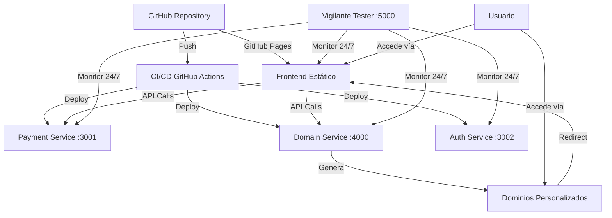

# VerixRichon Open Source Architecture

**VerixRichon Software Factory** | Noviembre 2025

## 🚀 Arquitectura 100% Open Source

Este documento describe la arquitectura completa de la plataforma VerixRichon, diseñada para ser **100% open source, auto-hospedada y sin límites**.

---

## Componentes del Ecosistema



---

## 1. Frontend (GitHub Pages)

**Puerto:** N/A (hosting estático)  
**URL:** `https://antigravityx.github.io/sombrerero/`  
**Ubicación:** `public/`

### Características:
- ✅ HTML5 + CSS3 + Vanilla JavaScript
- ✅ Hosting gratuito e ilimitado vía GitHub Pages
- ✅ SSL automático (HTTPS)
- ✅ CDN global de GitHub
- ✅ Deploy automático en cada push

### Archivos clave:
- `public/index.html` - Página principal del libro
- `public/js/payment.js` - Helper de pagos Stripe
- `public/style.css` - Estilos del sitio

---

## 2. Payment Service

**Puerto:** 3001  
**Ubicación:** `services/payment/`  
**Stack:** Node.js + Express + Stripe

### Endpoints:
```
GET  /health                    # Health check
POST /api/payment/create        # Crear sesión de checkout
POST /api/payment/webhook       # Webhook de Stripe
```

### Security:
- ✅ Helmet (headers de seguridad)
- ✅ Rate limiting (100 req/15min)
- ✅ CORS configurado
- ✅ Variables de entorno (.env)

### Uso:
```javascript
// Crear pago
const response = await fetch('http://localhost:3001/api/payment/create', {
  method: 'POST',
  headers: { 'Content-Type': 'application/json' },
  body: JSON.stringify({
    items: [{
      title: 'El Sombrerero',
      unit_price: 39.99,
      quantity: 1,
      currency: 'usd'
    }]
  })
});
const { checkout_url } = await response.json();
window.location.href = checkout_url;
```

---

## 3. Domain Service

**Puerto:** 4000  
**Ubicación:** `services/domains/`  
**Stack:** Node.js + Express + UUID

### Endpoints:
```
GET    /health                         # Health check
POST   /api/domains/create            # Crear dominio
GET    /api/domains/list              # Listar dominios
GET    /api/domains/:id               # Obtener dominio
PUT    /api/domains/:id/redirect      # Actualizar redirect
DELETE /api/domains/:id               # Eliminar dominio
GET    /r/:name                       # Redirect público
GET    /                              # Dashboard visual
```

### Uso:
```javascript
// Crear dominio personalizado
const domain = await fetch('http://localhost:4000/api/domains/create', {
  method: 'POST',
  headers: { 'Content-Type': 'application/json' },
  body: JSON.stringify({
    name: 'libro',
    target: 'https://antigravityx.github.io/sombrerero/',
    ssl: true
  })
});

// Resultado: http://localhost:4000/r/libro -> GitHub Pages
```

---

## 4. Vigilante Tester

**Puerto:** 5000 (dashboard)  
**Ubicación:** `services/testers/`  
**Stack:** Node.js + Axios + node-cron

### Funcionalidades:
- ✅ Monitoreo 24/7 de todos los servicios
- ✅ Tests de health cada 1 minuto
- ✅ Verificación SSL para URLs públicas
- ✅ Alertas automáticas si algo falla
- ✅ Dashboard HTTP en tiempo real
- ✅ Historial de tests

### Servicios monitoreados:
1. Payment Service (`localhost:3001/health`)
2. Domain Service (`localhost:4000/health`)
3. GitHub Pages (cuando esté activo)

### Dashboard:
Accede a `http://localhost:5000` para ver:
- Success rate en tiempo real
- Status de cada servicio
- Response times
- Historial de tests

### Comandos:
```bash
# Monitoreo continuo
npm start

# Single run (testing)
npm test
```

---

## Flujo Completo de Usuario

1. **Usuario accede** → `sombrerero.verixrichon.com` (domain service)
2. **Domain service redirige** → GitHub Pages
3. **Usuario navega** → Ve el libro y agrega al carrito
4. **Click en "Comprar"** → Frontend llama a Payment Service
5. **Payment Service** → Crea sesión con Stripe
6. **Usuario paga** → Stripe Checkout
7. **Stripe webhook** → Payment Service registra el pago
8. **Vigilante** → Monitoreando todo el proceso 24/7

---

## Deployment

### Desarrollo local:
```bash
# Payment service
cd services/payment && npm start

# Domain service
cd services/domains && npm start

# Vigilante
cd services/testers && npm start

# Frontend
# Abrir public/index.html en navegador
```

### Producción (Railway.app):
```bash
# 1. Crear cuenta en Railway.app
# 2. Conectar repositorio GitHub
# 3. Agregar servicios:
#    - payment-service (puerto 3001)
#    - domain-service (puerto 4000)
#    - vigilante (puerto 5000)
# 4. Configurar variables de entorno en cada servicio
# 5. Deploy automático en cada push
```

---

## Costos

| Servicio | Plan | Costo |
|----------|------|-------|
| GitHub Pages | Hosting | **$0** |
| GitHub Actions | CI/CD | **$0** (2000 min/mes) |
| Railway.app | Hosting | **$0** (500h/mes) |
| Stripe | Payments | **$0** (modo test) |
| Cloudflare | DNS | **$0** |
| **TOTAL** | | **$0/mes** 🎉 |

---

## Seguridad

✅ **Headers HTTP** - Helmet middleware  
✅ **Rate limiting** - Protecci ón DDoS  
✅ **CORS** - Control de origen  
✅ **HTTPS** - GitHub Pages + Cloudflare SSL  
✅ **Variables secretas** - `.env` (gitignored)  
✅ **Monitoreo 24/7** - Vigilante alertando  
✅ **Code auditable** - 100% open source en GitHub  

---

## Próximos Pasos

- [ ] Deploy a Railway.app
- [ ] Configurar dominio personalizado
- [ ] Webhook de Stripe en producción
- [ ] Notificaciones vía Discord/Slack
- [ ] Logs centralizados
- [ ] Métricas con Grafana

---

**Desarrollado con ❤️ por VerixRichon Software Factory**  
*"Open source, auto-hospedado, sin límites"* 🚀
