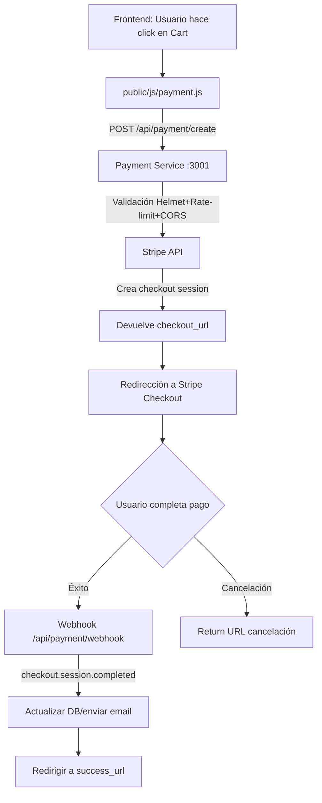

# Estrategia de Pago - VerixRichon

## Filosofía

Siguiendo los principios del **Alma VerixRichon**, hemos diseñado un sistema de pagos reutilizable, seguro y multi-plataforma que utiliza **Stripe** como proveedor de pagos con una capa de abstracción que permite integrar métodos de pago nativos del dispositivo.

## Arquitectura



## Componentes

### 1. Payment Service (Backend)
**Ubicación:** `services/payment/index.js`

**Tecnologías:**
- **Express** - Framework web
- **Stripe SDK** - Integración con Stripe
- **Helmet** - Seguridad HTTP headers
- **express-rate-limit** - Protección contra DDoS
- **CORS** - Control de acceso cross-origin
- **dotenv** - Variables de entorno

**Endpoints:**
- `GET /health` - Health check del servicio
- `POST /api/payment/create` - Crea sesión de checkout
- `POST /api/payment/webhook` - Recibe eventos de Stripe

**Seguridad implementada:**
✅ Rate limiting (100 req/15 min por IP)  
✅ CORS configurado para origen específico  
✅ Helmet con headers de seguridad  
✅ Validación de datos de entrada  
✅ Variables sensibles en `.env` (nunca en Git)  

### 2. Frontend Helper
**Ubicación:** `public/js/payment.js`

**Funciones:**
- `createPaymentAndRedirect(items, options)` - Crea sesión de pago y redirige
- `getCartItems()` - Obtiene items del carrito desde el DOM

**Uso:**
```javascript
// Método 1: Automático (escucha clicks en botón cart)
// Se activa automáticamente al cargar la página

// Método 2: Manual
const items = [
  {
    title: 'Libro: El Sombrerero',
    description: 'Edición física',
    unit_price: 39.99,
    quantity: 1,
    currency: 'usd'
  }
];

await window.VerixPayment.createPaymentAndRedirect(items, {
  metadata: { customer_id: '123', source: 'libro_page' }
});
```

### 3. Variables de entorno
**Ubicación:** `services/payment/.env`

```env
STRIPE_PUBLISHABLE_KEY=pk_test_...  # Para el frontend
STRIPE_SECRET_KEY=sk_test_...       # Para el backend
STRIPE_WEBHOOK_SECRET=whsec_...     # Para validar webhooks
JWT_SECRET=...                       # Para autenticación
PORT=3001
NODE_ENV=development
```

## Flujo de pago

1. **Usuario agrega items al carrito** → Click en botón "Cart"
2. **Frontend** llama a `/api/payment/create` con los items
3. **Backend** valida, crea sesión con Stripe, devuelve `checkout_url`
4. **Frontend** redirige a Stripe Checkout (hosted page)
5. **Usuario** completa el pago en Stripe
6. **Stripe** envía webhook a `/api/payment/webhook`
7. **Backend** procesa el evento, actualiza estado
8. **Usuario** es redirigido a `success_url`

## Próximos pasos

- [ ] Configurar webhook endpoint en Stripe Dashboard
- [ ] Implementar sistema de recompensas (puntos/cupones)
- [ ] Añadir autenticación JWT para usuarios registrados
- [ ] Crear panel de admin para gestionar pagos
- [ ] Agregar soporte para múltiples monedas

## Testing

### Tarjetas de prueba (modo test)
- **Éxito:** 4242 4242 4242 4242
- **Requiere autenticación:** 4000 0025 0000 3155
- **Decline:** 4000 0000 0000 9995

**Fecha:** Cualquier fecha futura  
**CVC:** Cualquier 3 dígitos  
**ZIP:** Cualquier 5 dígitos

## Comandos

```bash
# Instalar dependencias
cd services/payment
npm install

# Ejecutar servicio
npm start

# Modo desarrollo (con auto-reload)
npm run dev
```

---

**Creado con ❤️ por VerixRichon Software Factory**  
*"Codea una vez, utiliza siempre"*
